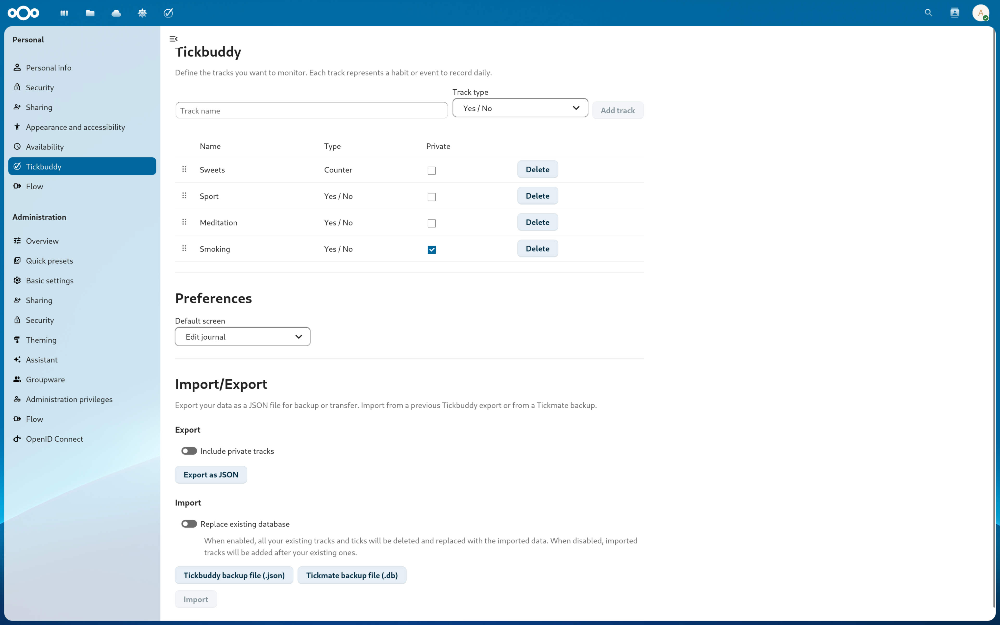
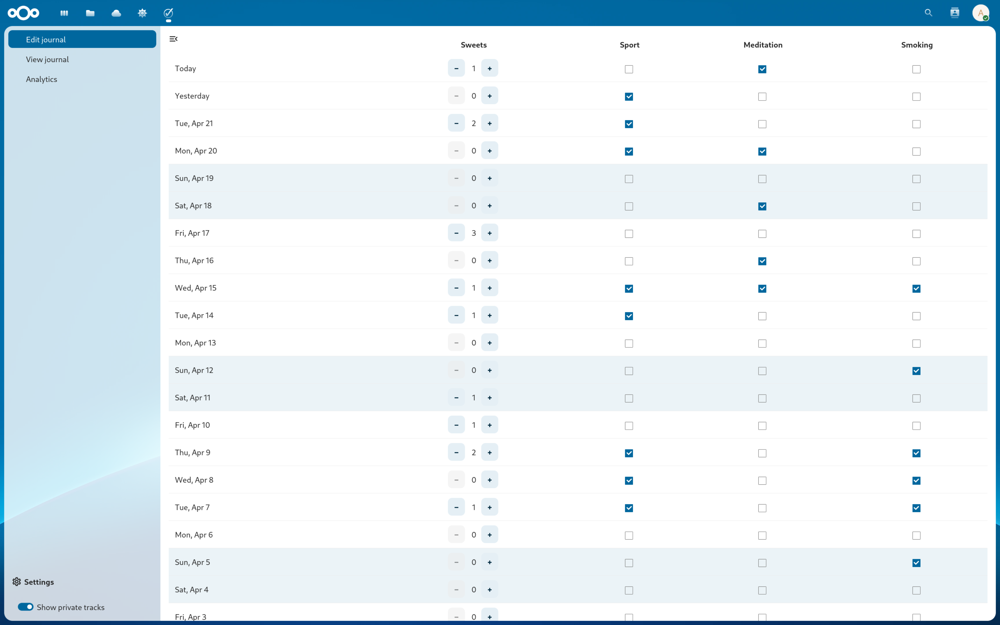
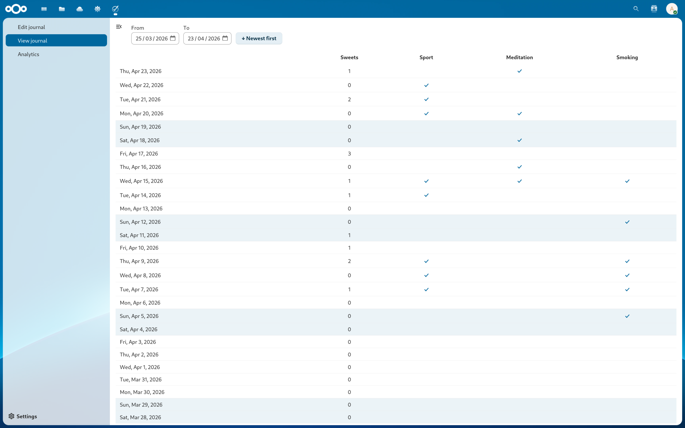
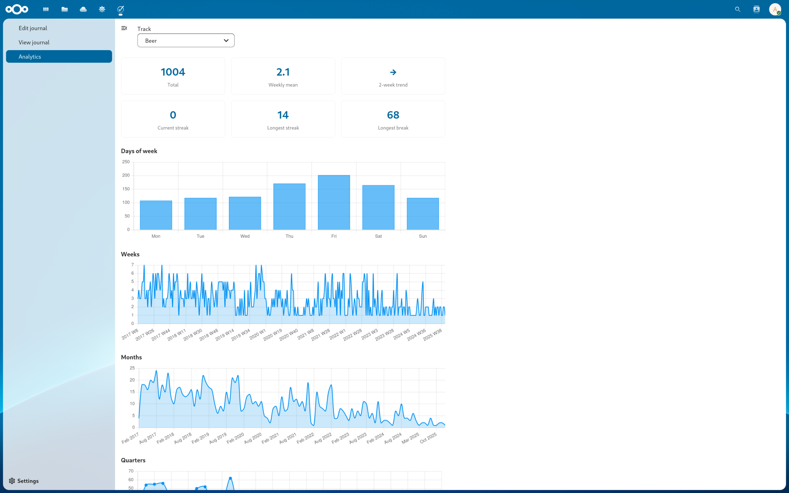

  # Tickbuddy

  Tickbuddy is a Nextcloud application for daily habit or occurence tracking. It is inspired by the "one-bit journal" Android app [Tickmate](https://f-droid.org/en/packages/de.smasi.tickmate/). 

  The application enables users to record whether a specific event has occured or not on daily basis. The events can be arbitrary habits or occurences such as doing sports, smoking, taking out trash, etc. These events are tracked over time, and longer term statistics and patterns can be analysed. The idea is to encourage healthy habits, get over bad ones, or simply to keep track of things over time.

  ### Features
  Some of the key features which already exist:
  * Settings screen to define, manage, delete events to be tracked 
  * Main app screen for journal entry
  * Read-only screen for journal viewing
  * Import data from Tickmate backup file
  * Import/export data in JSON format 
  * Sinple analytics screen with stats and trend visualizations

  Planned features:
  * Package and publish the app on Nextcloud App Store
  * Companion mobile app, i.e. replacement or fork of Tickmate
  * Maybe even a smartwatch app

  ### Motivation

  This is a personal hobby project which I am using to learn about Nextcloud app development and AI-assisted development. Significant portion of the code has been written by Claude Code. 

  Secondly, at the time of starting this project there is no equivalent app in the Nextcloud ecosystem. 

  ### Found a bug?

  Feel free to get in touch and/or submit an issue.

  ### Screenshots

  Settings screen
  

  Edit journal screen 
  

  View journal screen
  

  Analytics screen
  
