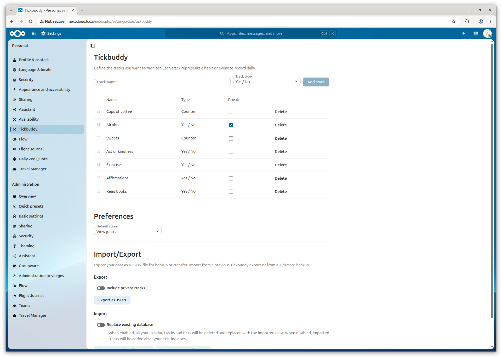
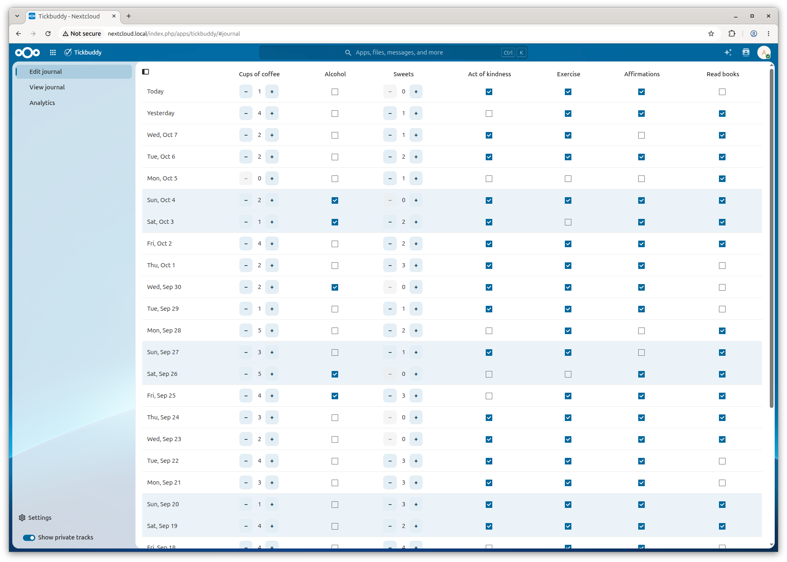
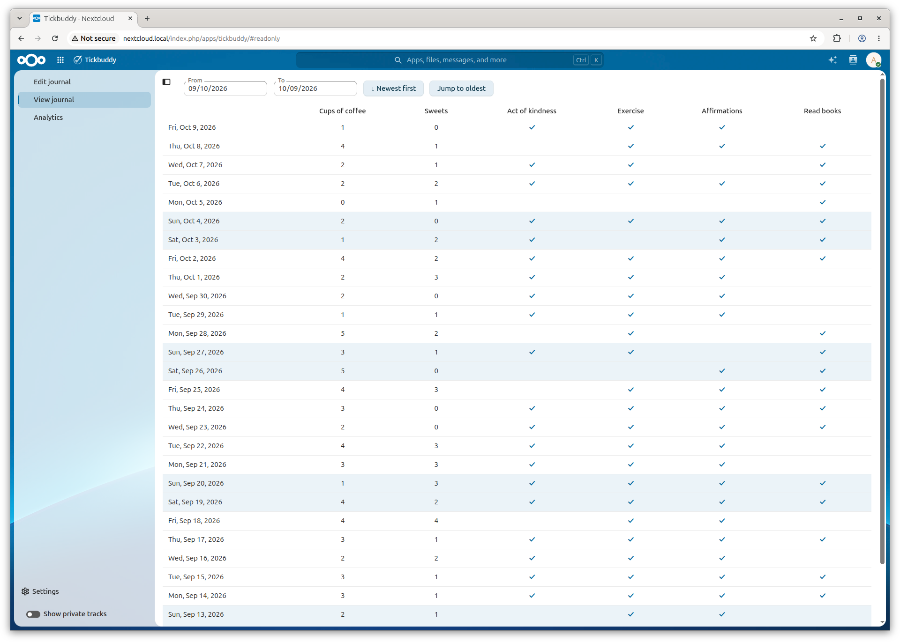
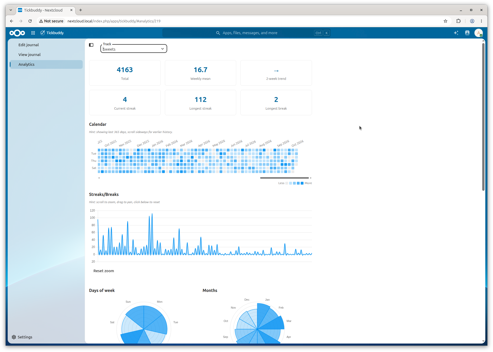
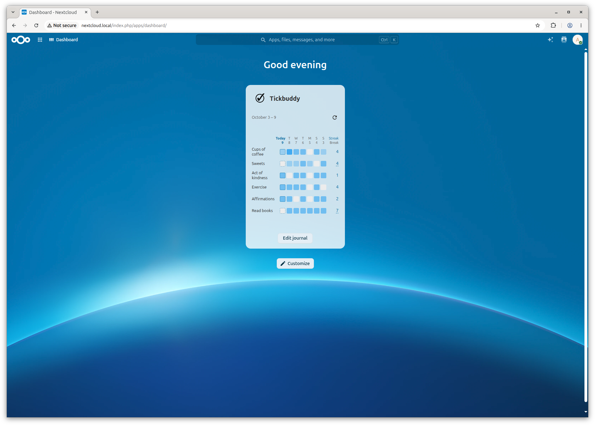

# Tickbuddy

Tickbuddy is a Nextcloud application for daily habit or occurrence tracking.

The application enables users to record whether a specific event has occurred or not on daily basis. The events can be arbitrary habits or occurrences such as doing sports, smoking, taking out trash, etc. These events are tracked over time, and longer term statistics and patterns can be analysed. The idea is to encourage healthy habits, get over bad ones, or simply to keep track of things over time.

Tickbuddy has been published on the [Nextcloud app store](https://apps.nextcloud.com/apps/tickbuddy), and its mobile companion app [Tickdroid](https://github.com/martinhammer/tickdroid) can be found on [F-Droid](https://f-droid.org/packages/com.martinhammer.tickdroid/).

### Features

Some of the key features which already exist:
* Settings screen to define, manage, delete events to be tracked
* Main app screen for journal entry
* Read-only screen for journal viewing
* Import data from Tickmate backup file
* Import/export data in JSON format
* Analytics screen with stats and various visualizations
* Nextcloud dashboard widget
* [Companion mobile app](https://github.com/martinhammer/tickdroid)

Planned features:
* Setting and tracking of goals
* Further enhancements to track management and analytics
* Migration options from other tools
* Support for translations
* Maybe even a smartwatch app

### Motivation

This is a personal hobby project which I am using to learn about Nextcloud app development and AI-assisted development. Significant portion of the code has been written by Claude Code.

Secondly, at the time of starting this project there is no equivalent app in the Nextcloud ecosystem, so I am hoping others will find this useful. Tickbuddy and Tickdroid were inspired by the "one-bit journal" Android app [Tickmate](https://f-droid.org/en/packages/de.smasi.tickmate/).

### Found a bug? Do you have some suggestions or a feature request?

Feel free to get in touch and/or submit an issue.

### Screenshots

Settings screen

Edit journal screen

View journal screen

Analytics screen

Dashboard Widget

